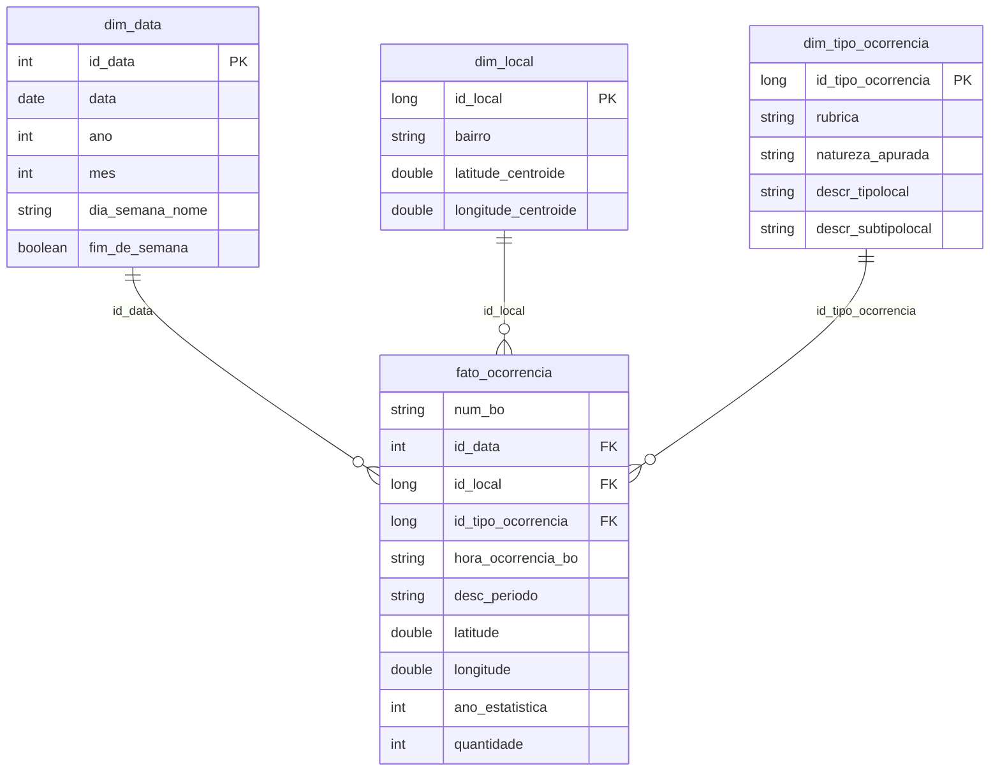

<div align="center">

# 🗺️ Mapa de Risco Criminal — Sorocaba/SP

**Pipeline de dados em nuvem para estruturação de ocorrências criminais públicas,
da coleta à análise, como base de um sistema de inteligência territorial de
segurança pública.**

[](https://www.databricks.com/try-databricks)
[](https://delta.io/)
[](https://creativecommons.org/licenses/by/4.0/)

</div>

---

## Sobre o projeto

Sorocaba não possui uma ferramenta pública e granular para visualização da
distribuição espaço-temporal de ocorrências criminais. Este projeto constrói
um pipeline completo — coleta, modelagem dimensional, carga e análise — sobre
os dados abertos da Secretaria de Segurança Pública do Estado de São Paulo
(SSP-SP), filtrados para o município de Sorocaba.

O resultado é uma base analítica estruturada em **Esquema Estrela**, pronta
para consulta SQL direta, e que serve como ponto de partida para um projeto
subsequente de Machine Learning voltado à predição de ocorrências.

## Arquitetura

```
┌──────────┐   ┌───────────┐   ┌──────────┐   ┌───────────┐   ┌────────────┐
│  RAW     │──>│ LANDING   │──>│ BRONZE   │──>│ SILVER    │──>│ GOLD       │
│ (.xlsx   │   │ PARQUET   │   │ (Delta,  │   │ (Delta,   │   │ (Esquema   │
│ por ano, │   │ (fiel,    │   │ união    │   │ reconcil. │   │ Estrela:   │
│ todo SP) │   │ string)   │   │ +audit.) │   │ +tipado   │   │ 1 fato +   │
│          │   │           │   │          │   │ +Sorocaba)│   │ 3 dim.)    │
└──────────┘   └───────────┘   └──────────┘   └───────────┘   └────────────┘
   download      conversão        Spark           Spark           Spark
  (script)       (script)       (notebook)      (notebook)      (notebook)
```

A etapa **Landing Parquet** existe porque o Spark não lê `.xlsx` nativamente e ler
~190 MB com pandas no driver do Community Edition estouraria a memória. A conversão
roda uma vez, localmente, e é o Parquet — não os `.xlsx` — que sobe ao Databricks.

**Plataforma:** Databricks Community Edition · **Formato:** Delta Lake ·
**Particionamento:** por ano de registro (`ano_estatistica`)

## Estrutura do repositório

```
.
├── docs/
│   ├── objetivo.md                  # Problema e perguntas de negócio
│   ├── catalogo_de_dados.md         # Domínio, linhagem e regras de cada tabela
│   ├── autoavaliacao.md             # Avaliação crítica do trabalho realizado
│   └── evidencias/                  # Screenshots/vídeos de execução no Databricks
│   ├── RUNBOOK_DATABRICKS.md         # Passo a passo de execução no Databricks
│   └── evidencias/                  # Screenshots/vídeos de execução no Databricks
├── notebooks/
│   ├── 01_pipeline_bronze_silver_gold.py   # ETL completo (Parquet → Delta, estrela)
│   ├── 02_qualidade_dados.py               # Análise de qualidade por atributo
│   └── 03_analise_perguntas_negocio.py     # Resposta às 6 perguntas + EDA
├── scripts/
│   ├── coletar_dados.py             # Coleta: download dos .xlsx da SSP-SP
│   ├── converter_para_parquet.py    # Conversão .xlsx → Parquet (landing)
│   └── validar_municipio.py         # Utilitário de validação de schema/grafia
└── data/
    └── schema_samples/              # Amostras pequenas de schema (dado completo não versionado)
```

## Fonte de dados

| | |
|---|---|
| **Origem** | [SSP-SP — Dados Abertos](https://www.ssp.sp.gov.br/estatistica/consultas), dataset "Números Sem Mistério" |
| **Licença** | Creative Commons Attribution 4.0 (CC-BY 4.0) |
| **Período** | 2022 a 2026 (ano corrente parcial, dados até abril/2026) |
| **Granularidade** | 1 linha = 1 rubrica registrada em 1 Boletim de Ocorrência |
| **Volume total** | ≈ 890 MB (5 arquivos anuais) |

> O dado bruto é estadual (todo o Estado de São Paulo); o recorte para
> Sorocaba é aplicado na camada Silver, não na coleta — ver
> [Catálogo de Dados](docs/catalogo_de_dados.md) para detalhes da decisão.

## Modelo de dados



**Fato:** `fato_ocorrencia` — grão de 1 rubrica por BO. Coordenadas e logradouro são
dimensões *degeneradas* (alta cardinalidade → ficam na fato).

**Dimensões:** `dim_data` (calendário), `dim_local` (grão de **bairro**, com centroide
para mapas) e `dim_tipo_ocorrencia` (rubrica, natureza apurada, tipo/subtipo de local).
Chaves naturais nulas usam o membro `NÃO INFORMADO` para evitar FK nula.

Documentação completa de domínio, valores esperados e linhagem em
[`docs/catalogo_de_dados.md`](docs/catalogo_de_dados.md).

## Principais desafios técnicos resolvidos

- **Reconciliação de schema entre 5 anos de arquivos**, com nomes de coluna
  divergentes (`CIDADE` vs `NOME_MUNICIPIO`, cedilha em colunas de circunscrição)
  e uma coluna inexistente antes de 2025 (`DESCR_TIPOLOCAL`) — resolvido por
  `coalesce` por nome de coluna (nunca por posição).
- **FK nula por `NULL = NULL` não casar em join** — o caso mais perigoso: como
  `descr_tipolocal` é nulo em todo 2022–2024, um join ingênuo descartaria a maioria
  dos registros. Resolvido com o membro sentinela `NÃO INFORMADO`.
- **Sentinelas da fonte** (`0` em lat/long, `'NULL'`, `'(Vazio)'`, `'-'`) tratadas
  como nulo real, com evidência da limpeza na análise de qualidade.
- **Formato real das datas** (datetime do Excel, não `M/D/YY`) e a distinção entre
  ano de ocorrência e ano de registro (`ano_estatistica`).
- **Inconsistência de grafia** em `"SOROCABA "` (espaço à direita) e em `desc_periodo`.
- **Cobertura parcial de 2026**: comparação Jan-Abr entre anos para evitar viés.

## Como reproduzir

```bash
# 1. Coleta (local): baixa os .xlsx da SSP-SP
python3 scripts/coletar_dados.py

# 2. Conversão (local): gera data/parquet/ (landing que sobe ao Databricks)
python3 scripts/converter_para_parquet.py
```

3. Suba o diretório `data/parquet/` para um Volume/DBFS do Databricks.
4. Importe os notebooks de `notebooks/` no workspace Databricks.
5. Ajuste `RAW_PARQUET_PATH` (e `SCHEMA`) na 1ª célula do notebook `01`.
6. Execute na ordem: `01` → `02` → `03`.

Passo a passo detalhado em [`docs/RUNBOOK_DATABRICKS.md`](docs/RUNBOOK_DATABRICKS.md).

## Próximos passos

Este projeto é a primeira etapa de um trabalho em duas partes. O MVP
seguinte utiliza a camada Gold aqui construída como base de features para
um modelo preditivo de ocorrências criminais por bairro e período.

---

<div align="center">
<sub>Dados públicos sob licença CC-BY 4.0 · SSP-SP</sub>
</div>
