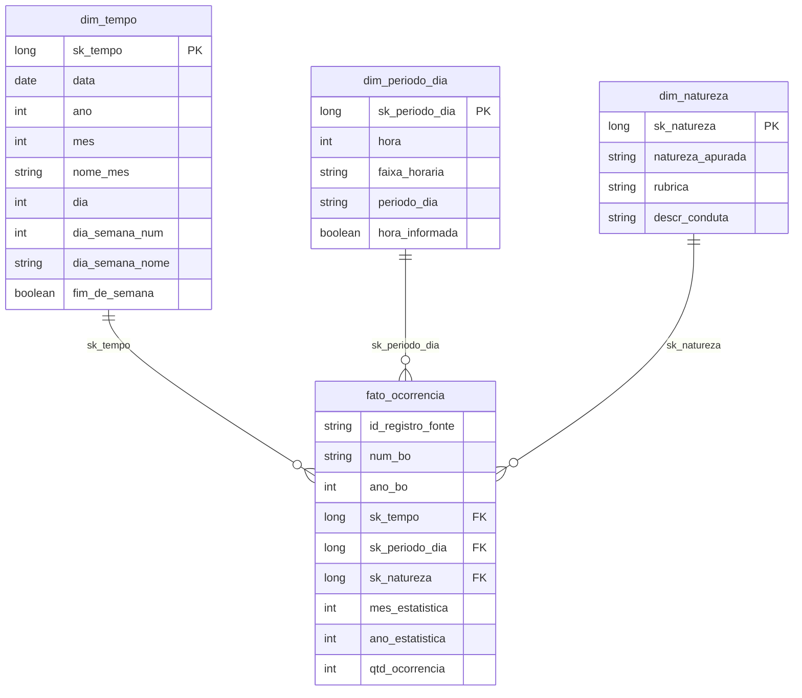

# Ocorrências registradas em Sorocaba — MVP de Engenharia de Dados

Pipeline em Databricks que transforma arquivos anuais da Secretaria da Segurança
Pública do Estado de São Paulo (SSP-SP) em tabelas Delta nas camadas Bronze,
Silver e Gold. O recorte cobre ocorrências cuja circunscrição pertence a Sorocaba
(código IBGE `3552205`) nos quatro anos completos de 2022 a 2025.

> **Autoria e modalidade:** trabalho individual de **Paulo Musachio
> (`pmusachio`)** para o MVP de Engenharia de Dados. As decisões, o código, a
> execução e a interpretação dos resultados são de responsabilidade do autor.

> **Estado desta versão:** valores e conclusões marcados como
> `PENDENTE DE EXECUÇÃO` só podem ser substituídos pelos resultados de uma execução
> integral no Databricks. Nenhum número foi antecipado ou inventado.

## 1. Contexto de Negócio e Perguntas

### Problema e objetivo

Os dados de ocorrências policiais são publicados em arquivos anuais extensos, com
variações de esquema e valores ausentes. Isso dificulta a consulta conjunta do
histórico municipal. Este MVP cria uma base persistente, documentada e verificável
para analisar **ocorrências registradas** em Sorocaba. Elas não são tratadas como
medida direta de criminalidade real, risco individual ou efetividade policial.

O público interessado inclui estudantes, pesquisadores e cidadãos que desejem
consultar estatísticas descritivas. O trabalho responde a três perguntas:

1. Como evoluiu o volume mensal e anual de ocorrências registradas em Sorocaba
   entre 2022 e 2025?
2. Quais naturezas concentram o maior volume e como as principais variaram no
   período?
3. Como as naturezas mais frequentes se distribuem por dia da semana e período do
   dia?

O período foi limitado a quatro anos completos. O ano parcial de 2026 foi excluído
para não produzir comparações assimétricas.

### Histórico de escopo

A versão anterior continha seis perguntas. Elas permanecem registradas apenas para
tornar a simplificação transparente:

| Pergunta anterior | Tratamento nesta versão |
|---|---|
| Quais bairros concentram mais ocorrências e como isso muda? | Retirada: bairro e geografia não são necessários à entrega. |
| Existe sazonalidade por dia, mês e horário? | Consolidada nas perguntas 1 e 3. |
| Quais tipos predominam por bairro/região? | Simplificada para natureza e variação temporal, na pergunta 2. |
| Há tendência de crescimento, queda ou estabilidade? | Consolidada na pergunta 1, como descrição dos registros. |
| Existe relação entre tipo de local e tipo de ocorrência? | Retirada: o campo não cobre uniformemente os quatro anos. |
| Existe correlação espacial entre tipos de ocorrência? | Retirada: exigiria geografia e método fora do escopo. |

### Limites de interpretação

- Uma linha representa um registro administrativo, não necessariamente um evento
  independente nem toda a criminalidade ocorrida.
- Um BO pode conter mais de uma natureza; `num_bo` isolado não é chave única.
- Ausência ou imprecisão de data, hora ou classificação reduz a cobertura.
- Os resultados não sustentam causalidade, previsão, comparação de risco individual
  ou recomendação operacional.

## 2. Carga dos Dados

### Fonte e contexto bruto

| Item | Definição |
|---|---|
| Publicador | Secretaria da Segurança Pública do Estado de São Paulo |
| Conjunto | Números sem Mistério / dados criminais |
| Página oficial | [Consultas estatísticas da SSP-SP](https://www.ssp.sp.gov.br/estatistica/consultas) |
| Arquivos | `SPDadosCriminais_2022.xlsx` a `SPDadosCriminais_2025.xlsx` |
| URL direta | `https://www.ssp.sp.gov.br/assets/estatistica/transparencia/spDados/SPDadosCriminais_{ANO}.xlsx` |
| Data de acesso | 5 de setembro de 2026 |
| Abrangência original | Estado de São Paulo |
| Recorte | Circunscrição de Sorocaba, código IBGE `3552205` |
| Período | 2022, 2023, 2024 e 2025 completos |
| Grão | Uma natureza registrada em uma linha de BO |
| Abas e colunas | Duas abas semestrais por ano; 29 colunas fonte em 2022–2024, 30 em 2025 e 33 nomes normalizados distintos na união |
| Tamanho publicado | 2022: 199.282.273 B; 2023: 218.413.769 B; 2024: 197.574.881 B; 2025: 195.899.014 B; o manifesto confirma os bytes efetivamente baixados |
| Termos de uso | A [política de dados abertos da SSP-SP](https://www.ssp.sp.gov.br/transparencia/dados-abertos) prevê acesso e reutilização de dados públicos. Não foi identificada licença Creative Commons específica na página consultada; a evidência dos termos efetivamente exibidos acompanha a entrega. |

A fonte foi escolhida porque contém data e classificação necessárias às perguntas.
Endereços, coordenadas e campos alheios ao recorte analítico não seguem para a
Silver/Gold e nenhum dado bruto é publicado neste repositório.

Checksums observados na coleta de 5 de setembro de 2026:

| Ano | Tamanho (bytes) | SHA-256 |
|---:|---:|---|
| 2022 | 199.282.273 | `608399e58e40da0d8dbb30d73db62add1408b4f354191c12f629b108b8f7e810` |
| 2023 | 218.413.769 | `84c595a451251b3c532f4483a672134813e5ec3e224ca27db58ec4854ee801df` |
| 2024 | 197.574.881 | `b58715efaf1128c971fc5113b5a856cbb29e3e09ece8706e2eec1827fbf10d26` |
| 2025 | 195.899.014 | `4ab5b40229d245a0f50b65e74ea9e9b7750bbdb3bff7b02d961d78b9c4143d8c` |

### Aquisição e persistência

1. Execute [`scripts/coletar_dados.py`](scripts/coletar_dados.py) localmente para
   baixar os quatro XLSX e calcular os checksums.
2. Envie os arquivos, sem alteração, para
   `/Volumes/workspace/sorocaba_seguranca/dados/xlsx/`.
3. Execute [`notebooks/00_coleta_bronze.py`](notebooks/00_coleta_bronze.py), que
   realiza uma carga integral manual de 2022–2025.
4. O notebook valida os arquivos, lê as abas em lotes com `openpyxl`, localiza
   `CD_IBGE` pelo cabeçalho (aceitando também o alias histórico `COD_IBGE`) e
   mantém somente `3552205` na captura Bronze.
5. Os XLSX originais permanecem imutáveis no Volume e não entram no Git.

O filtro durante a leitura reduz memória, mas a Bronze municipal preserva todas as
colunas e valores como texto. Arquivo, aba, ano, instante e hash permitem rastrear
cada linha até sua origem.


## 3. Modelagem e Catálogo de Dados

### Arquitetura e grão

```text
SSP-SP
  └─ XLSX 2022–2025 no Unity Catalog Volume (originais imutáveis)
       └─ bronze_manifesto + bronze_recorte_sorocaba
            └─ silver_ocorrencias
                 ├─ dim_tempo
                 ├─ dim_periodo_dia
                 ├─ dim_natureza
                 └─ fato_ocorrencia
                      ├─ perfil_qualidade_bronze
                      ├─ perfil_qualidade_silver
                      └─ validacoes_qualidade
```

- **Plataforma:** Databricks Free Edition.
- **Catálogo/schema:** `workspace.sorocaba_seguranca`.
- **Volume:** `workspace.sorocaba_seguranca.dados`, pasta `xlsx`.
- **Formato:** Delta Lake.
- **Modelo Gold:** esquema estrela.
- **Grão da fato:** uma natureza criminal em um registro-fonte deduplicado de BO
  cuja circunscrição possui código IBGE `3552205`.
- **Medida:** `qtd_ocorrencia = 1`, aditiva em todas as dimensões.
- **Desconhecido:** exatamente uma linha `sk = -1` por dimensão.



### Catálogo completo das tabelas persistidas

Os tipos e domínios abaixo formam o contrato do pipeline. Mínimos, máximos,
cardinalidades e categorias observados devem ser transcritos das tabelas de perfil
somente depois da execução.

<details>
<summary><strong>bronze_manifesto</strong> — um registro por arquivo e execução</summary>

| Coluna | Tipo | Domínio e descrição |
|---|---|---|
| `ano_arquivo` | int | 2022–2025 |
| `arquivo` | string | Nome do XLSX |
| `url_fonte` | string | URL HTTPS da SSP-SP |
| `caminho_volume` | string | Caminho absoluto em `/Volumes/.../xlsx/` |
| `tamanho_bytes` | bigint | Inteiro positivo obtido do arquivo |
| `sha256` | string | 64 caracteres hexadecimais dos bytes originais |
| `guias` | string | Lista das abas processadas |
| `linhas_estaduais_lidas` | bigint | Linhas de dados percorridas |
| `linhas_sorocaba_mantidas` | bigint | Linhas cujo código IBGE é `3552205` |
| `dt_ingestao` | timestamp | Instante da execução |
| `status` | string | `OK`; uma falha interrompe a carga antes da publicação do manifesto |

</details>

<details>
<summary><strong>bronze_recorte_sorocaba</strong> — captura textual municipal</summary>

As colunas originais são convertidas para identificadores maiúsculos ASCII com
underscore; seus **valores não são transformados**. Variações anuais permanecem
separadas e campos ausentes ficam nulos.

| Coluna fonte normalizada | Tipo | Conteúdo |
|---|---|---|
| `NOME_DEPARTAMENTO` | string | Departamento de registro |
| `NOME_SECCIONAL` | string | Seccional de registro |
| `NOME_DELEGACIA` | string | Delegacia de registro |
| `CIDADE` | string | Município de registro na variante de 2022 |
| `NOME_MUNICIPIO` | string | Município de registro nas demais variantes |
| `NUM_BO` | string | Número do BO |
| `ANO_BO` | string | Ano do BO ainda sem tipagem |
| `DATA_COMUNICACAO_BO` | string | Data de registro na variante de 2022 |
| `DATA_REGISTRO` | string | Data de registro nas demais variantes |
| `DATA_OCORRENCIA_BO` | string | Data informada da ocorrência |
| `HORA_OCORRENCIA_BO` | string | Hora informada |
| `DESCR_PERIODO` | string | Período na variante de 2022 |
| `DESC_PERIODO` | string | Período nas demais variantes |
| `DESCR_TIPOLOCAL` | string | Grupo do local, quando disponível |
| `DESCR_SUBTIPOLOCAL` | string | Subgrupo do local |
| `BAIRRO` | string | Bairro informado |
| `LOGRADOURO` | string | Logradouro informado |
| `NUMERO_LOGRADOURO` | string | Número informado |
| `LATITUDE` | string | Latitude informada |
| `LONGITUDE` | string | Longitude informada |
| `NOME_DEPARTAMENTO_CIRCUNCRICAO` | string | Departamento do local do fato; grafia observada na fonte |
| `NOME_SECCIONAL_CIRCUNCRICAO` | string | Seccional do local do fato; grafia observada na fonte |
| `NOME_DELEGACIA_CIRCUNCRICAO` | string | Delegacia do local do fato; grafia observada na fonte |
| `NOME_MUNICIPIO_CIRCUNCRICAO` | string | Município do local do fato; grafia observada na fonte |
| `RUBRICA` | string | Classificação jurídica registrada |
| `DESCR_CONDUTA` | string | Conduta/circunstância associada |
| `NATUREZA_APURADA` | string | Natureza apurada informada |
| `MES_ESTATISTICA` | string | Mês de entrada na estatística |
| `ANO_ESTATISTICA` | string | Ano de entrada na estatística |
| `CMD` | string | Comando da Polícia Militar |
| `BTL` | string | Batalhão da Polícia Militar |
| `CIA` | string | Companhia da Polícia Militar |
| `CD_IBGE` | string | Código municipal observado nos arquivos atuais; filtro `3552205` |
| `id_registro_fonte` | string | SHA-256 de todas as colunas originais, sem auditoria |
| `_arquivo_origem` | string | Nome do XLSX |
| `_guia_origem` | string | Aba de origem |
| `_ano_arquivo` | int | 2022–2025 |
| `_dt_ingestao` | timestamp | Instante da captura |

O notebook 00 imprime e perfila a união real dos cabeçalhos. Uma coluna nova deve
ser avaliada e acrescentada a este catálogo antes da entrega final.

</details>

<details>
<summary><strong>silver_ocorrencias</strong> — dados reconciliados e deduplicados</summary>

| Coluna | Tipo | Domínio e descrição | Origem/regra |
|---|---|---|---|
| `id_registro_fonte` | string | SHA-256, chave técnica única | Bronze |
| `cod_ibge` | int | Apenas `3552205` | `try_cast(cod_ibge)` e filtro |
| `num_bo` | string | Pode repetir | `num_bo`; sentinelas para nulo |
| `ano_bo` | int | Ano válido ou nulo | `try_cast(ano_bo)` |
| `dt_ocorrencia_bo` | date | Data válida ou nulo | `data_ocorrencia_bo` |
| `hora_ocorrencia_bo` | int | 0–23 ou nulo | Hora extraída com parse tolerante |
| `periodo_dia` | string | `MADRUGADA`, `MANHÃ`, `TARDE`, `NOITE`, `HORA INCERTA` ou nulo | Período limpo/derivado |
| `origem_periodo` | string | `FONTE`, `DERIVADO DA HORA` ou `NÃO INFORMADO` | Indicador da regra aplicada |
| `rubrica` | string | Texto limpo ou nulo | `rubrica` |
| `natureza_apurada` | string | Texto limpo ou nulo | `natureza_apurada` |
| `descr_conduta` | string | Texto limpo ou nulo | `descr_conduta` |
| `mes_estatistica` | int | 1–12 ou nulo | `try_cast(mes_estatistica)` |
| `ano_estatistica` | int | Ano válido ou nulo | `try_cast(ano_estatistica)` |
| `_arquivo_origem` | string | XLSX de origem | Bronze |
| `_guia_origem` | string | Aba de origem | Bronze |
| `_ano_arquivo` | int | 2022–2025 | Bronze |
| `_dt_ingestao` | timestamp | Instante da captura | Bronze |

</details>

<details>
<summary><strong>dim_tempo</strong> — uma linha por data, mais sentinela</summary>

| Coluna | Tipo | Domínio e descrição |
|---|---|---|
| `sk_tempo` | bigint | Chave determinística; `-1` para desconhecido |
| `data` | date | Limites `PENDENTE DE EXECUÇÃO`; nulo na sentinela |
| `ano` | int | Ano civil ou `-1` |
| `mes` | int | 1–12 ou `-1` |
| `nome_mes` | string | Janeiro–Dezembro ou `NÃO INFORMADO` |
| `dia` | int | 1–31 ou `-1` |
| `dia_semana_num` | int | 1–7 ou `-1` |
| `dia_semana_nome` | string | Domingo–Sábado ou `NÃO INFORMADO` |
| `fim_de_semana` | boolean | `true`, `false` ou nulo na sentinela |

</details>

<details>
<summary><strong>dim_periodo_dia</strong> — hora e faixa temporal</summary>

| Coluna | Tipo | Domínio e descrição |
|---|---|---|
| `sk_periodo_dia` | bigint | Chave determinística; `-1` para desconhecido |
| `hora` | int | 0–23 ou nulo quando não informada |
| `faixa_horaria` | string | Intervalo horário derivado ou `NÃO INFORMADO` |
| `periodo_dia` | string | Categoria documentada ou `NÃO INFORMADO` |
| `hora_informada` | boolean | Indica hora válida |

</details>

<details>
<summary><strong>dim_natureza</strong> — classificação da ocorrência</summary>

| Coluna | Tipo | Domínio e descrição |
|---|---|---|
| `sk_natureza` | bigint | Chave determinística; `-1` para desconhecido |
| `natureza_apurada` | string | Categoria observada ou `NÃO INFORMADO` |
| `rubrica` | string | Classificação observada ou `NÃO INFORMADO` |
| `descr_conduta` | string | Conduta observada ou `NÃO INFORMADO` |

</details>

<details>
<summary><strong>fato_ocorrencia</strong> — uma linha por registro deduplicado</summary>

| Coluna | Tipo | Domínio e descrição |
|---|---|---|
| `id_registro_fonte` | string | Chave técnica única da Silver |
| `num_bo` | string | Identificador degenerado; pode repetir |
| `ano_bo` | int | Ano do BO ou nulo |
| `sk_tempo` | bigint | FK não nula para `dim_tempo` |
| `sk_periodo_dia` | bigint | FK não nula para `dim_periodo_dia` |
| `sk_natureza` | bigint | FK não nula para `dim_natureza` |
| `mes_estatistica` | int | 1–12 ou nulo |
| `ano_estatistica` | int | Ano estatístico ou nulo |
| `qtd_ocorrencia` | int | Sempre `1`; medida aditiva |

</details>

<details>
<summary><strong>matriz_transformacoes</strong> — auditoria das mudanças</summary>

| Coluna | Tipo | Descrição |
|---|---|---|
| `ordem` | int | Ordem da transformação |
| `regra` | string | Regra aplicada |
| `motivo` | string | Justificativa |
| `campos_afetados` | string | Lista dos atributos |
| `linhas_antes` | bigint | Contagem de entrada |
| `linhas_depois` | bigint | Contagem de saída |
| `linhas_afetadas` | bigint | Quantidade alterada ou removida |
| `dt_execucao` | timestamp | Instante da execução |

</details>

<details>
<summary><strong>perfil_qualidade_bronze</strong> e <strong>perfil_qualidade_silver</strong></summary>

As duas tabelas usam o mesmo contrato e contêm uma linha por atributo.

| Coluna | Tipo | Descrição |
|---|---|---|
| `camada` | string | `BRONZE` ou `SILVER` |
| `atributo` | string | Nome da coluna perfilada |
| `tipo_dado` | string | Tipo Spark/Delta |
| `total_linhas` | bigint | Total da tabela |
| `qtd_nulos` / `pct_nulos` | bigint / double | Completude observada |
| `qtd_distintos` | bigint | Cardinalidade |
| `valor_min` / `valor_max` | string | Limites como texto ou `N/A` |
| `completude_status` / `completude_justificativa` | string | Avaliação fundamentada |
| `consistencia_status` / `qtd_inconsistentes` / `consistencia_justificativa` | string / bigint / string | Tipo, formato, domínio e coerência |
| `unicidade_status` / `qtd_duplicados` / `unicidade_justificativa` | string / bigint / string | Unicidade ou `N/A` justificado |
| `acuracia_contextual_status` / `qtd_sem_confirmacao` / `acuracia_contextual_justificativa` | string / bigint / string | Plausibilidade sem alegar conferência externa |
| `outliers_status` / `qtd_outliers` / `outliers_justificativa` | string / bigint / string | Outliers ou `N/A` justificado |
| `impacto_analitico` | string | Efeito sobre as perguntas |
| `dt_perfil` | timestamp | Instante do perfil |

</details>

<details>
<summary><strong>validacoes_qualidade</strong> — testes do pipeline/modelo</summary>

| Coluna | Tipo | Descrição |
|---|---|---|
| `categoria` | string | Completude, consistência, unicidade, integridade ou reconciliação |
| `validacao` | string | Nome estável da regra |
| `resultado_observado` | string | Valor produzido |
| `resultado_esperado` | string | Condição de aceitação |
| `status` | string | `OK`, `ATENÇÃO`, `INFORMATIVO` ou `ERRO` |
| `detalhe` | string | Diagnóstico e impacto |
| `dt_validacao` | timestamp | Instante do teste |

</details>

### Linhagem de coluna da Gold

| Destino | Origem Silver | Origem Bronze | Regra |
|---|---|---|---|
| `dim_tempo.*` | `dt_ocorrencia_bo` | `data_ocorrencia_bo` | Parse tolerante e derivações civis |
| `dim_periodo_dia.hora` | `hora_ocorrencia_bo` | `hora_ocorrencia_bo` | Extração/validação 0–23 |
| `dim_periodo_dia.periodo_dia` | `periodo_dia` | `descr_periodo`/`desc_periodo`; hora como fallback | Normalização e derivação rastreada |
| `dim_natureza.*` | Campos homônimos | `natureza_apurada`, `rubrica`, `descr_conduta` | Limpeza textual |
| `fato_ocorrencia.id_registro_fonte` | Mesmo nome | Hash da linha original | Deduplicação apenas por hash |
| `fato_ocorrencia.num_bo` / `ano_bo` | Campos homônimos | `num_bo` / `ano_bo` | Limpeza e tipagem |
| FKs | Chaves naturais Silver | Data, hora/período e natureza | Join; ausência recebe `-1` |
| `mes_estatistica` / `ano_estatistica` | Campos homônimos | Campos homônimos | Tipagem tolerante |
| `qtd_ocorrencia` | — | — | Literal `1` |


## 4. Pipeline de Dados

### Ordem de execução

| Ordem | Artefato | Responsabilidade | Saídas |
|---:|---|---|---|
| 1 | [`00_coleta_bronze.py`](notebooks/00_coleta_bronze.py) | Inventário, leitura em lotes, filtro municipal e hash | Manifesto e Bronze |
| 2 | [`01_pipeline_bronze_silver_gold.py`](notebooks/01_pipeline_bronze_silver_gold.py) | Reconciliação, tipagem, limpeza, deduplicação e estrela | Silver, Gold e matriz |
| 3 | [`02_qualidade_dados.py`](notebooks/02_qualidade_dados.py) | Perfil por atributo e testes de integridade | Perfis e validações |
| 4 | [`03_analise_perguntas_negocio.py`](notebooks/03_analise_perguntas_negocio.py) | Três perguntas, tabelas, gráficos e conclusão | Resultados no notebook |

### Matriz de transformações

As contagens abaixo devem ser copiadas de `matriz_transformacoes` depois da
execução, nunca estimadas.

| Regra | Motivo | Campos | Antes | Depois |
|---|---|---|---:|---:|
| Sanitizar apenas nomes de coluna | Compatibilidade Delta | Cabeçalhos Bronze | `PENDENTE` | `PENDENTE` |
| Filtrar Sorocaba durante a leitura | Não persistir o conjunto estadual | `CD_IBGE`/`COD_IBGE` | `PENDENTE` | `PENDENTE` |
| Conciliar aliases por nome | Variações anuais | Período e seleção dos campos canônicos | `PENDENTE` | `PENDENTE` |
| Converter sentinelas em nulo | Representar ausência real | Campos Silver | `PENDENTE` | `PENDENTE` |
| Tipar com conversões tolerantes | Medir inválidos sem abortar | Datas, inteiros e hora | `PENDENTE` | `PENDENTE` |
| Confirmar `cod_ibge = 3552205` | Impedir outro município | `cod_ibge` | `PENDENTE` | `PENDENTE` |
| Normalizar categorias | Evitar diferença só por caixa/espaço | Natureza, rubrica, conduta, período | `PENDENTE` | `PENDENTE` |
| Derivar período só se ausente e hora válida | Aumentar cobertura com rastreio | `periodo_dia`, `origem_periodo` | `PENDENTE` | `PENDENTE` |
| Deduplicar por `id_registro_fonte` | Remover somente linhas idênticas | Registro completo | `PENDENTE` | `PENDENTE` |
| Resolver FKs e criar medida unitária | Impedir FK nula e conservar o grão | Três FKs e `qtd_ocorrencia` | `PENDENTE` | `PENDENTE` |

### Reprodução em workspace novo

Pré-requisitos: conta no Databricks Free Edition, acesso ao GitHub e Python 3 local.
Não há credenciais versionadas.

1. Clone este repositório em um Git folder do Databricks.
2. Execute localmente `python3 scripts/coletar_dados.py`.
3. Confirme quatro arquivos, anos 2022–2025, e guarde seus checksums.
4. No Catalog Explorer, crie/use `workspace.sorocaba_seguranca` e o Volume `dados`.
5. Crie a pasta `xlsx` e envie os quatro arquivos originais.
6. Execute manualmente os notebooks `00`, `01`, `02` e `03`, nessa ordem.
7. Se um teste obrigatório falhar, corrija a causa e reexecute desde o notebook 00.
8. Capture as evidências e substitua somente os resultados observados neste README.


## 5. Qualidade de Dados

O notebook 02 perfila **cada coluna** de `bronze_recorte_sorocaba` e
`silver_ocorrencias`, incluindo atributos Bronze que não seguem para a Silver. Ele
avalia completude, consistência, unicidade, acurácia contextual e outliers. Quando
uma dimensão não se aplica, registra `N/A` e uma justificativa.

| Teste | Esperado | Observado |
|---|---|---|
| Arquivos no manifesto | 4 distintos, 2022–2025, checksum válido | `PENDENTE DE EXECUÇÃO` |
| Recorte municipal | 100% com `cod_ibge = 3552205` | `PENDENTE DE EXECUÇÃO` |
| Hash | Nenhum nulo | `PENDENTE DE EXECUÇÃO` |
| Deduplicação | Zero repetição do hash na Silver | `PENDENTE DE EXECUÇÃO` |
| Hora | Somente 0–23 ou nulo | `PENDENTE DE EXECUÇÃO` |
| Período | Somente categorias documentadas | `PENDENTE DE EXECUÇÃO` |
| Datas impossíveis/futuras | Zero; datas antigas plausíveis não são rejeitadas | `PENDENTE DE EXECUÇÃO` |
| Sentinelas | Exatamente uma chave `-1` por dimensão | `PENDENTE DE EXECUÇÃO` |
| FKs nulas/órfãs | Zero | `PENDENTE DE EXECUÇÃO` |
| Conservação | `SUM(qtd_ocorrencia) = COUNT(silver_ocorrencias)` | `PENDENTE DE EXECUÇÃO` |
| Cobertura do perfil | Todas as colunas Bronze e Silver | `PENDENTE DE EXECUÇÃO` |

**Resultado da qualidade:** `PENDENTE DE EXECUÇÃO`. Resumir aqui os problemas
observados, seu impacto em cada pergunta e as diferenças entre Bronze e Silver. O
fim do pipeline, sozinho, não comprova boa qualidade.


## 6. Análise de Dados

Os resultados são produzidos pelo notebook 03 sobre a Gold. Cada consulta exibe
tabela, gráfico, cobertura e reconciliação com a fato.

### Pergunta 1 — evolução mensal e anual

- **Método:** `SUM(qtd_ocorrencia)` por ano e mês da `dim_tempo`.
- **Resposta:** `PENDENTE DE EXECUÇÃO`.
- **Discussão/limitação:** `PENDENTE DE EXECUÇÃO`; informar cobertura de data
  e não equiparar variação nos registros a variação causal na criminalidade.
- **Reconciliação:** `PENDENTE DE EXECUÇÃO`.


### Pergunta 2 — naturezas mais frequentes e variação

- **Método:** ranking no período completo e evolução anual das principais.
- **Resposta:** `PENDENTE DE EXECUÇÃO`.
- **Discussão/limitação:** `PENDENTE DE EXECUÇÃO`; registrar desconhecidos e
  possíveis mudanças classificatórias.
- **Reconciliação:** `PENDENTE DE EXECUÇÃO`.


### Pergunta 3 — dia da semana e período do dia

- **Método:** principais naturezas da pergunta 2 agregadas por dia e período.
- **Resposta:** `PENDENTE DE EXECUÇÃO`.
- **Discussão/limitação:** `PENDENTE DE EXECUÇÃO`; mostrar a proporção sem
  hora/período e não ocultar `NÃO INFORMADO`.
- **Reconciliação:** `PENDENTE DE EXECUÇÃO`.


### Conclusão geral

`PENDENTE DE EXECUÇÃO`: conectar os três achados ao objetivo, explicar o que a
base permite observar e o que permanece indeterminado. Não extrapolar frequências
administrativas para causalidade, risco ou intervenção.

## 7. Autoavaliação

### Atingimento dos objetivos

| Pergunta | Status | Evidência | Limitação determinante |
|---|---|---|---|
| Evolução mensal/anual | `PENDENTE: Sim / Parcial / Não` | Notebook 03 e imagem 09 | Atualizar com cobertura real de data |
| Naturezas e variação | `PENDENTE: Sim / Parcial / Não` | Notebook 03 e imagem 10 | Atualizar com cobertura classificatória |
| Dia da semana e período | `PENDENTE: Sim / Parcial / Não` | Notebook 03 e imagem 11 | Atualizar com cobertura de hora/período |

### Dificuldades encontradas

- Leitura de XLSX grandes em ambiente limitado, tratada com `openpyxl` em lotes.
- Variações de nomes/disponibilidade de colunas, reconciliadas por nome.
- Sentinelas textuais e tipagem estrita, tratadas antes da conversão tolerante.
- Diferença entre município de registro e circunscrição, resolvida pelo código
  IBGE do local do fato.
- Risco de remover fatos legítimos, evitado ao deduplicar somente pelo hash de toda
  a linha original.

Acrescentar somente dificuldades realmente observadas na nova execução.

### Limitações

- Uma fonte e um município.
- Dependência da cobertura e semântica dos registros administrativos.
- Sem denominador populacional: resultados são contagens, não taxas.
- Sem validação externa da acurácia de cada BO.
- Período parcialmente dependente da disponibilidade da hora.
- Evidências e resultados ainda dependem da execução final.

### Trabalhos futuros

Somente depois de todos os testes e evidências desta versão estarem completos:

- avaliar fonte populacional para taxas comparáveis;
- investigar outra fonte oficial que responda a uma pergunta adicional clara;
- ampliar o período quando existir outro ano completo;
- testar o mesmo contrato em outros municípios.

### Reflexão final

`PENDENTE DE EXECUÇÃO`: registrar se o pipeline cumpriu o objetivo, quais
perguntas foram respondidas integral/parcialmente, quais decisões mais impactaram o
resultado e o que seria feito de outra forma.

## Evidências finais e conferência


- [ ] Quatro notebooks executados em ordem, sem erro.
- [ ] Todo `PENDENTE DE EXECUÇÃO` substituído por valor real.
- [ ] Catálogo conferido com `DESCRIBE TABLE` para todas as tabelas.
- [ ] Toda coluna Bronze e Silver presente no perfil.
- [ ] Testes aprovados ou reprovações discutidas.
- [ ] Três perguntas com tabela, gráfico, resposta, discussão e limitação.
- [ ] Conclusão e autoavaliação baseadas em resultados observados.
- [ ] As 13 imagens existem, são legíveis e aparecem neste README.
- [ ] Nenhum dado bruto, endereço, coordenada, BO, credencial ou PDF do curso no Git.
