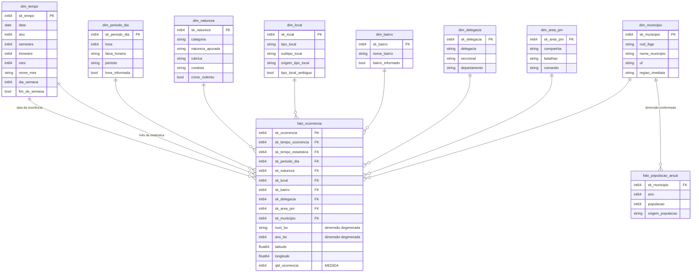

# 3. Modelagem

O descritivo pede um modelo "em Esquema Estrela ou Snowflake, como em um Data Warehouse, ou flat por cada conceito, como em um Data Lake". A escolha aqui é o **esquema estrela**, implementado em BigQuery pela abordagem **ROLAP** — "utilizando uma abordagem ROLAP, cada fato e dimensão do esquema de um DW é implementado em uma tabela" (Aula 1).

O DDL completo está em [`sql/10_ddl_dw.sql`](../sql/10_ddl_dw.sql).

## Por que estrela, e não floco de neve

O esquema estrela exige que as dimensões sejam **desnormalizadas**: as hierarquias de cada dimensão viram atributos da própria tabela, sem tabelas auxiliares. É uma violação deliberada da normalização, e a Aula 1 explica por quê:

> "Para aumentar o desempenho, é comum que tabelas de dimensão sejam desnormalizadas (violando um dos princípios do modelo relacional tradicional), com hierarquias implícitas. O impacto da desnormalização não deve ser grande, uma vez que as operações de consulta tipicamente excedem, e muito, em frequência as operações de atualização dos registros das tabelas dimensão."

É exatamente o caso aqui: as dimensões são recarregadas uma vez por ciclo de ingestão e consultadas em toda análise. Normalizar `dim_delegacia` em três tabelas (departamento → seccional → delegacia) só acrescentaria junções a cada consulta, sem benefício.

## O esquema

## O fato e sua granularidade

**Granularidade:** uma natureza criminal apurada em um boletim de ocorrência com circunscrição em Sorocaba.

Essa definição não foi suposta — foi **verificada nos dados**. Um mesmo boletim pode gerar mais de uma linha: no arquivo de 2026, 66 boletins de Sorocaba aparecem em mais de uma linha, e a inspeção mostra por quê:

| NUM_BO | RUBRICA | NATUREZA_APURADA |
|---|---|---|
| AA2631 | Lesão corporal (art. 129) | LESAO CORPORAL DOLOSA |
| AA2631 | Roubo (art. 157) | ROUBO - OUTROS |

É o mesmo evento, com duas naturezas apuradas. Tratar isso como duplicidade e remover uma das linhas **apagaria um crime**; tratar o boletim como grão impediria analisar por natureza. Por isso o grão é a natureza dentro do boletim, e `num_bo`/`ano_bo` permanecem na tabela fato como **dimensões degeneradas** — identificam o boletim, não têm atributos descritivos próprios e não justificam uma tabela.

**Medida:** `qtd_ocorrencia`, que vale sempre 1. Fatos são, por definição, "medidas obrigatoriamente numéricas e aditivas" (Aula 1); somar essa coluna em qualquer combinação de dimensões responde "quantas ocorrências".

## As dimensões

| Dimensão | Perspectiva (5W1H) | Hierarquia |
|---|---|---|
| `dim_tempo` | **quando** | ano → semestre → trimestre → mês → dia |
| `dim_periodo_dia` | **quando** (hora do dia) | período → faixa horária → hora |
| `dim_natureza` | **o quê** | categoria → natureza apurada → rubrica → conduta |
| `dim_local` | **onde** (tipo de lugar) | tipo → subtipo |
| `dim_bairro` | **onde** (território) | bairro |
| `dim_delegacia` | **quem** (responsável, Polícia Civil) | departamento → seccional → delegacia |
| `dim_area_pm` | **quem** (responsável, Polícia Militar) | comando → batalhão → companhia |
| `dim_municipio` | **onde** (referência externa) | UF → região intermediária → região imediata → município |

A heurística usada para chegar a elas é a da Aula 1: "buscar respostas para as perguntas quem, quando, onde, o que, por que e como, uma vez que dimensões refletem as perspectivas 5W1H de qualquer cenário".

### Decisões de modelagem que merecem justificativa

**1. A dimensão tempo aparece duas vezes no fato.**
`sk_tempo_ocorrencia` aponta para quando o fato aconteceu; `sk_tempo_estatistica`, para o mês em que a ocorrência entrou na estatística oficial da SSP-SP. As duas datas divergem com frequência, porque o arquivo de cada ano é fechado pela segunda. Manter apenas uma delas seria escolher entre reproduzir os números oficiais e analisar sazonalidade corretamente — com as duas, o DW faz ambos, e cada consulta declara qual usa.

**2. `dim_municipio` existe mesmo tendo uma única linha útil.**
Poderia parecer supérfluo em um DW de um só município. Ela existe por três razões: é o **dado de referência** externo que permite validar o município (Governança, Aula 2); é a **dimensão conformada** que liga os dois fatos do modelo; e é o que torna o modelo extensível a outros municípios sem redesenho.

**3. Dois fatos, e não um.**
`fato_populacao_anual` compartilha `dim_municipio` com `fato_ocorrencia`. Dois fatos que compartilham dimensões formam uma **constelação de fatos**, um dos três tipos de esquema apresentados na Aula 1; o núcleo do modelo continua sendo uma estrela. A alternativa — guardar a população como atributo de uma dimensão — estaria errada: população é uma medida numérica, varia no tempo e é aditiva. É um fato.

**4. A delegacia do modelo é a de circunscrição, não a de registro.**
Os dados trazem as duas. A verificação mostrou que, no primeiro semestre de 2026, a "DELEGACIA ELETRONICA" responde por 4.783 dos 8.069 registros de Sorocaba — ou seja, a delegacia *de registro* é majoritariamente um canal online, sem qualquer relação territorial com o local do fato. Usá-la faria a análise territorial apontar para um endereço na internet. A de circunscrição, com 11 valores distintos, todos distritos policiais de Sorocaba, é a que responde "onde".

**5. Chaves surrogate em todas as dimensões, inclusive tempo.**
"A chave primária da tabela fato é uma chave surrogate (um código sequencial e sem significado)... Em uma tabela dimensão, a chave primária deve ser simples (recomenda-se um surrogate)" (Aula 1). Cada dimensão tem ainda uma linha de chave `-1` para "não informado", de modo que um fato sem bairro ou sem hora continue existindo nas junções em vez de desaparecer da contagem.

## Metadados na própria plataforma

Toda tabela e toda coluna do DW carregam a cláusula `OPTIONS(description=...)` no DDL. Com isso, a descrição semântica e o domínio esperado de cada atributo ficam gravados no BigQuery e visíveis para quem consultar o dado, e não apenas neste repositório. É o "repositório de metadados" que a arquitetura de BI da Aula 1 prevê como componente, aqui materializado dentro do próprio SGBD.

O catálogo de dados completo, no formato pedido pela apostila de Qualidade de Dados, está em [`04-catalogo-de-dados.md`](04-catalogo-de-dados.md).

---

**Anterior:** [2. Coleta](02-coleta.md) · **Próximo:** [4. Catálogo de dados](04-catalogo-de-dados.md)
