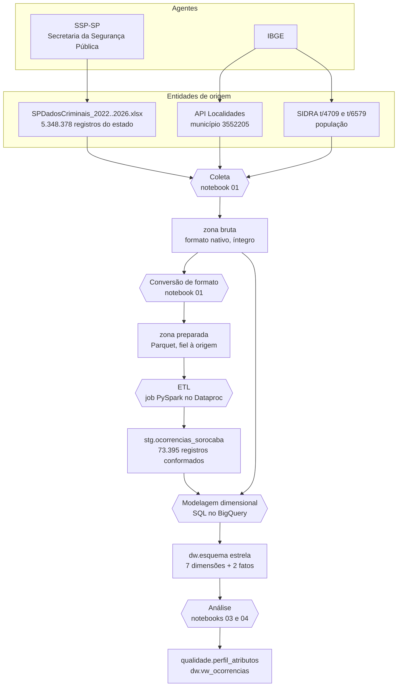

# 9. Linhagem dos dados

> "A existência do registro da linhagem dos dados é uma das condições necessárias para a garantia da qualidade dos dados. Erros e problemas existentes em um determinado conjunto de dados podem ser mais bem avaliados, pois a linhagem indicará todas as transformações realizadas nas versões anteriores, que podem, por sua vez, serem auditadas na busca da causa raiz de um determinado problema."
> — Governança de Dados, Aula 2

Esta página responde a três perguntas sobre cada dado do data warehouse: **de onde veio**, **por quais transformações passou** e **quem decidiu o quê**. A notação segue os três elementos do padrão **PROV**, do W3C, citado na apostila: entidades (os conjuntos de dados), atividades (as transformações) e agentes (quem ou o que as executou).

## Grafo de proveniência

## Linhagem em nível de coluna

Para cada atributo do data warehouse: de que campo da origem ele veio e o que foi feito com ele.

| Atributo no DW | Campo de origem | Transformações aplicadas |
|---|---|---|
| `dim_tempo.data` | `DATA_OCORRENCIA_BO` | serial do Excel → data; sem outra alteração |
| `dim_tempo` (2º papel) | `ANO_ESTATISTICA` + `MES_ESTATISTICA` | ligação pelo primeiro dia do mês de referência |
| `dim_periodo_dia.hora` | `HORA_OCORRENCIA_BO` | fração do dia → hora cheia; `NULL` textual → nulo |
| `dim_periodo_dia.periodo` | `DESC_PERIODO` / `DESCR_PERIODO` | padronização; **derivado da hora quando ausente** (T6) |
| `dim_natureza.natureza_apurada` | `NATUREZA_APURADA` | **padronização de acentos e traços** (T4): 28 grafias → 23 naturezas |
| `dim_natureza.categoria` | *derivado* | de-para por título do Código Penal ([`15_de_para_natureza.sql`](../sql/15_de_para_natureza.sql)) |
| `dim_natureza.crime_violento` | *derivado* | mesmo de-para |
| `dim_natureza.rubrica` / `.conduta` | `RUBRICA` / `DESCR_CONDUTA` | sentinelas → nulo; **grafia da origem preservada** |
| `dim_local.tipo_local` | `DESCR_TIPOLOCAL` | **derivado do subtipo em 2022-2024** (T5), com marcação de origem e de ambiguidade |
| `dim_local.subtipo_local` | `DESCR_SUBTIPOLOCAL` | sentinelas → nulo |
| `dim_bairro.nome_bairro` | `BAIRRO` | padronização de caixa e acentos (T4) |
| `dim_delegacia.*` | `NOME_*_CIRCUNSCRICAO` | conciliação de grafias entre anos (T1) |
| `dim_area_pm.*` | `CMD`, `BTL`, `CIA` | sentinelas → nulo |
| `dim_municipio.*` | **API de Localidades do IBGE** | nenhuma; é o dado de referência |
| `fato_ocorrencia.latitude` / `.longitude` | `LATITUDE` / `LONGITUDE` | texto → decimal; **zero → nulo** (T2) |
| `fato_ocorrencia.num_bo` / `.ano_bo` | `NUM_BO` / `ANO_BO` | nenhuma |
| `fato_ocorrencia.qtd_ocorrencia` | *derivado* | constante 1 |
| `fato_populacao_anual.populacao` | **SIDRA t/4709 e t/6579** | **2023 interpolado** entre 2022 e 2024 (T8) |

## Colunas de auditoria

Cada registro carrega, desde a ingestão, a marca de onde veio:

| Coluna | Conteúdo |
|---|---|
| `_arquivo_origem` | nome do `.xlsx` de origem |
| `_guia_origem` | aba do arquivo (ex.: `JUL-DEZ_2024`) |
| `_dt_ingestao` | momento da conversão para a zona preparada |
| `ano_arquivo` | partição da zona preparada |
| `dt_processamento` | momento da execução do job Spark |

Além delas, três colunas registram a procedência de valores que **não vieram prontos da fonte** — sem as quais um dado derivado seria indistinguível de um dado publicado:

| Coluna | Para que serve |
|---|---|
| `origem_tipo_local` | separa tipo publicado de tipo derivado do subtipo |
| `tipo_local_ambiguo` | marca as derivações cujo subtipo admite mais de um tipo |
| `origem_periodo` | separa período publicado de período derivado da hora |
| `origem_populacao` | separa Censo, estimativa oficial e valor interpolado |
| `natureza_apurada_origem` | preserva a grafia original antes da padronização |

## Registro de decisões

Decisões tomadas ao longo do trabalho que alteram o dado ou o seu escopo, com a justificativa e onde foram implementadas.

### D1 — Não carregar o endereço exato do fato (LGPD)

**Decisão.** Os campos `LOGRADOURO` e `NUMERO_LOGRADOURO` existem na origem, são preservados na zona bruta e na zona preparada, e **não são carregados no data warehouse**.

**Justificativa.** A Aula 3 de Governança recomenda que dados com potencial de identificação sejam anonimizados quando usados em análises. O endereço exato do fato não é necessário a nenhuma das oito perguntas de negócio — o bairro e as coordenadas já respondem à dimensão territorial — e a própria SSP-SP já suprime esse campo nos registros mais sensíveis, substituindo-o pelo texto `VEDAÇÃO DA DIVULGAÇÃO DOS DADOS RELATIVOS` em 26% das linhas de Sorocaba em 2026.

**Onde:** o de-para de [`spark/etl_ocorrencias.py`](../spark/etl_ocorrencias.py) simplesmente não inclui esses campos.

**O que a base não contém:** nome, documento, idade ou sexo de vítimas ou autores. Não há, portanto, dado pessoal identificável no DW.

### D2 — Filtrar o município pela circunscrição, não pelo registro

**Decisão.** O critério de inclusão é `COD IBGE = 3552205`, que acompanha a delegacia de **circunscrição** (onde o fato ocorreu).

**Justificativa.** O objetivo declarado é medir a criminalidade *em* Sorocaba. O município de registro identifica onde o boletim foi digitado, que em mais da metade dos casos é a Delegacia Eletrônica — um canal online sem relação territorial com o fato.

**Efeito mensurável:** em 2026, o critério inclui 8.069 registros; o critério alternativo incluiria 8.104, dos quais 48 são fatos ocorridos em outros municípios. A coluna `registrado_em_outro_municipio` preserva a informação para quem quiser analisá-la.

### D3 — Derivar o tipo de local para os anos que não o publicam

**Decisão.** Aplicar aos anos de 2022 a 2024 a correspondência subtipo → tipo observada em 2025 e 2026.

**Justificativa e limite.** Sem isso, a pergunta P5 valeria para dois dos cinco anos. Com isso, ela vale para todos — mas com erro conhecido: 42 dos 302 subtipos admitem mais de um tipo. A pergunta P5 é respondida apenas sobre os anos publicados; o dado derivado fica disponível, marcado.

### D4 — Interpolar a população de 2023

**Decisão.** Preencher 2023 com a média entre o Censo 2022 e a estimativa de 2024, marcando a linha como `interpolado`.

**Justificativa.** O IBGE não publicou estimativa para 2023 (o Censo do ano anterior interrompeu a série). Sem o valor, a taxa por 100 mil de 2023 não existiria e a série ficaria com um buraco. A interpolação é aceitável porque a população municipal varia de forma suave, mas o número **não é oficial** e a coluna de origem impede que seja confundido com um.

### D5 — Manter dois papéis da dimensão tempo

**Decisão.** O fato aponta duas vezes para `dim_tempo`: data da ocorrência e mês da estatística oficial.

**Justificativa.** As duas datas divergem, e cada uma responde a uma pergunta diferente. Séries anuais usam a estatística, para reproduzir os números oficiais da SSP-SP; sazonalidade e horário usam a ocorrência, porque são propriedades de quando o fato aconteceu. Cada consulta em [`sql/45_perguntas_negocio.sql`](../sql/45_perguntas_negocio.sql) declara qual usa.

### D6 — Preservar as sentinelas até o ETL

**Decisão.** `NULL`, `(Vazio)`, `-` e o `0` das coordenadas chegam intactos à zona preparada e só viram nulo no job Spark.

**Justificativa.** Limpá-los na ingestão apagaria a evidência do problema antes que a análise de qualidade pudesse medi-lo. A zona preparada é fiel à origem por princípio: é o que permite reprocessar tudo com regras diferentes sem voltar à fonte.

---

**Anterior:** [8. Autoavaliação](08-autoavaliacao.md)
